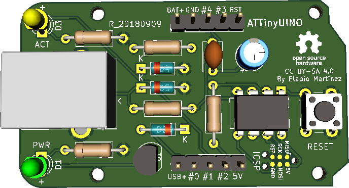
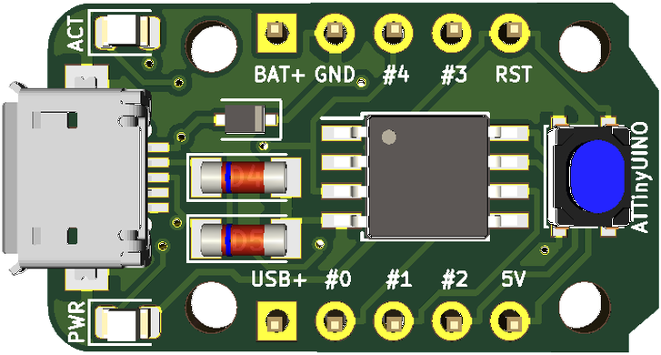

# Official ATTinyUINO DIY Board Repository

For more details on design, assembly and programming, visit the documentation: [ATTinyUINO-docs](https://github.com/mafe72/ATTinyUINO/tree/master/ATTinyUINO-docs)

License
-------

 

This project is open hardware licensed under the Attribution-ShareAlike 4.0 (CC BY-SA 4.0) license. The full legal text of the license may be found in the LICENSE.md file in this repository. For more information about this license, please visit 
the Creative Commons Foundation (https://creativecommons.org/licenses/by-sa/4.0/).

Characteristics of ATTinyUINO DIY
-------

- Single Face Plate - To make it easier to make homemade
- Components in TH - For manual mounting (SMD is also available)
- ATtiny85-20PU Micro-controller - Arduino Compatibility
- 5 pin I / O - All micro-controller pins will be available
- POWER LED - LED for power indication
- General purpose LED connected to I/O pin 1

----------
ATTinyUINO TH Front Side:

----------
ATTinyUINO SMD Front Side:

----------
ATTinyUINO SMD Back Side:

----------

Project
-------

The PCB design was originally developed in Kicad.

# Contribution

## Suggestions and Bugs in Hardware

You should report bugs or suggestions via [Issues area](https://github.com/mafe72/ATTinyUINO/issues) here in github.

Make sure you meet the following criteria when creating / submitting your issue:

- Use a clear and descriptive title to identify the problem / suggestion.
- Describe the exact steps to reproduce the problem in as much detail as possible.
- Mention where this problem was found / what your suggestion will affect.

## Contribution to hardware improvements

Community contributions are always welcome!

This section is intended to help anyone interested in contributing to this repository.
Before you contribute, first get approval from the repository and community maintainers by raising a problem from GitHub using the guidelines mentioned in the suggestions section.
 
Once you get approved, you will need to do the following steps (these instructions assume that you are a GitHub user).

- 1: Fork this repository.
- 2: Make changes, commit and push to the fork.
- 3: Submit your Pull Request.

## If you have any questions please contact me

info@attinyuino.com